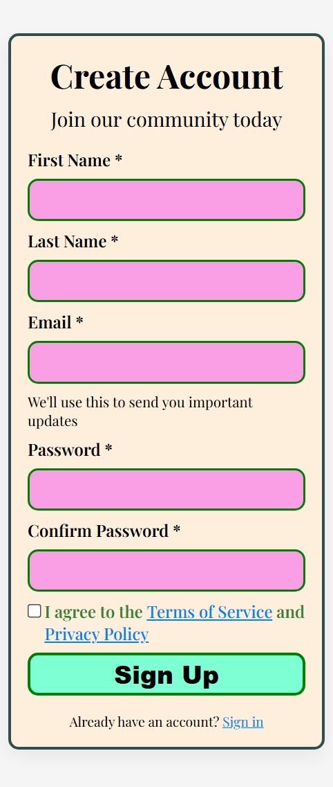

# Signup Page

A responsive signup form built with HTML5 and CSS3, featuring modern design with fluid typography and mobile-first approach.

## Preview



## Features

- **Responsive Design**: Uses `clamp()` for fluid typography and spacing
- **Modern Styling**: Glassmorphism effect with custom shadows  
- **Accessibility**: Semantic HTML with proper form labels and validation
- **Mobile-First**: Optimized for all screen sizes
- **Custom Properties**: CSS variables for consistent design system

## Technologies Used

- HTML5 (Semantic structure)
- CSS3 (Custom properties, Flexbox, Clamp functions)
- Google Fonts (Playfair Display)

## File Structure

```
signup-page/
├── index.html
├── style.css
├── signup-page-preview.png
└── README.md
```

## Live Preview

**Note**: GitHub doesn't render HTML files directly in repositories. To view the page:

1. Download the files
2. Open `index.html` in your browser
3. Or use [GitHub Pages](https://pages.github.com/) to host it live

## Quick Start

```bash
git clone https://github.com/Poojan157/front-end-mini-projects.git
cd front-end-mini-projects/signup-page
open index.html
```